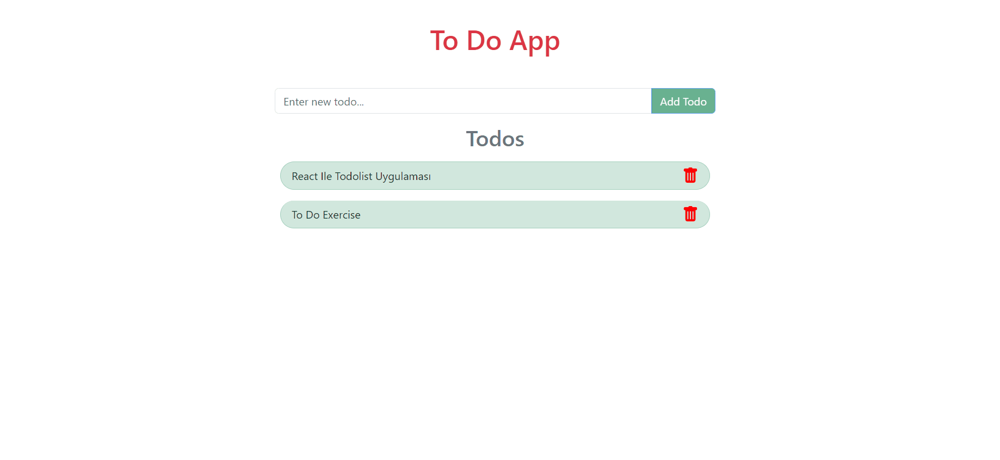

<h1>Soner Ozciftci</h1>
<h3>React-ToDo-App</h3>
<br>
## Project Skeleton
```
React-ToDo-App(folder)
|
|----readme.md       
SOLUTION
├── public
│     └── index.html
├── src
│    ├── components
│    │       ├── Header.jsx
│    │       │
│    │       ├── TodoList.jsx
│    │
│    │
│    
│    │
│    │
│    │
│    ├── App.js
│    ├── index.js
│    └── index.css
├── package.json
└── yarn.lock
```
## Objective
Build a Todo App using ReactJS.
### At the end of the project, following topics are to be covered;
- HTML
- CSS
- JS
- ReactJS
## ToDo App Projects Demo
[Todo App Live](to-do-app-react-x5zzcstbf-soner-ozciftci.vercel.app)
## ToDo App Projects

